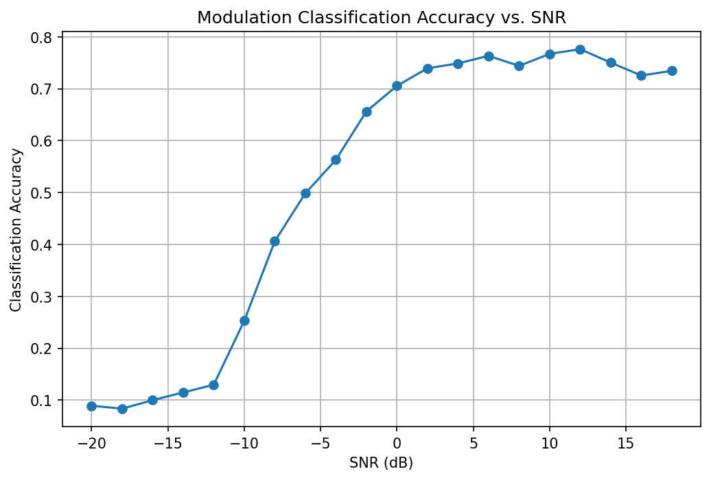
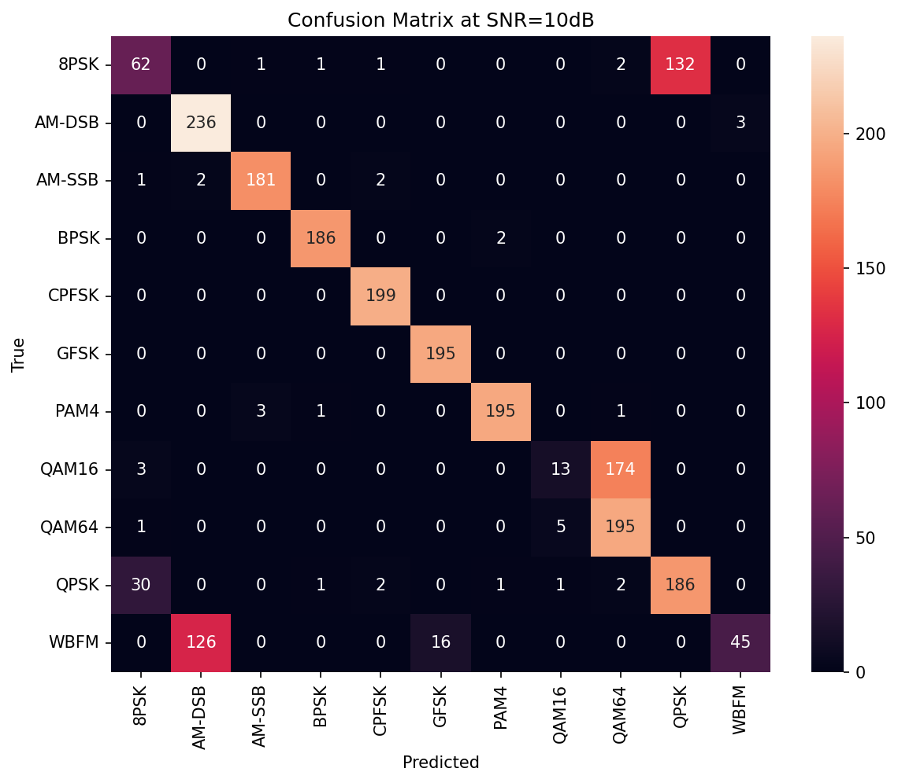
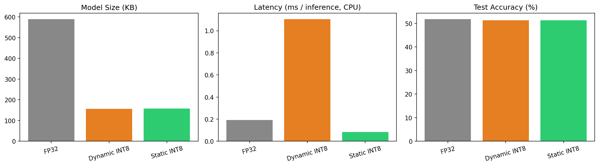

# Edge-Deployed Modulation Classifier

A 1D CNN that identifies the modulation scheme of a radio signal directly from raw I/Q samples, then shrinks it with ONNX INT8 quantization for fast, small-footprint inference. The project compares **dynamic** and **static** quantization on the same model and explains why one helps and the other hurts.

Trained on the RadioML 2016.10a benchmark (11 modulation types, SNR from -20 dB to +18 dB).

## Why this problem

In a normal link (WiFi, 4G), both sides agree on the modulation in advance. In **non-cooperative** settings, such as spectrum sensing, cognitive radio, and signal monitoring, a receiver has to work out what it is hearing without being told. This task is called Automatic Modulation Classification (AMC). The devices that do it sit in the field, run on batteries, and need answers in milliseconds, so a small, fast model matters.

## Method

| Step | Detail |
|---|---|
| Dataset | RadioML 2016.10a: 220,000 signal windows, each 2 x 128 (I and Q channels), 11 classes, 20 SNR levels |
| Split | 80/20 train/test, stratified by class (176,000 / 44,000) |
| Model | 1D CNN: 3 conv blocks (64, 128, 128 filters) + 2-layer classifier, 11 outputs |
| Training | Adam, lr 1e-3 with step decay, 30 epochs, batch size 256, PyTorch |
| Export | ONNX (classic TorchScript exporter) |
| Quantization | ONNX Runtime: dynamic INT8 and static INT8 (QDQ format, 100 calibration samples) |
| Benchmark | ONNX Runtime CPU provider, batch size 1, 500 timed runs after warmup |

## Results

### Classification accuracy

Overall test accuracy (FP32): **51.83%**.

That single number understates the model, because it averages over every SNR level, including the very noisy ones where the signal is buried. The per-SNR curve shows what is really happening:

| SNR range | Accuracy | What is going on |
|---|---|---|
| -20 to -14 dB | 8-12% | Near chance (random guessing over 11 classes is 9.1%). The signal is buried in noise. |
| -12 to 0 dB | 13% to 71% | Transition zone: accuracy climbs steeply as noise drops. |
| 2 to 18 dB | 72-78% | Plateau. Best value is 77.6% at 12 dB; 76.7% at 10 dB. |

Full per-SNR values are in `results/results.json`.



The plateau stays below 80% even at high SNR because some pairs of schemes are hard to tell apart no matter how clean the signal is. At 10 dB, most classes are separated cleanly. The errors that remain are between closely related schemes, such as 8PSK/QPSK, 16-QAM/64-QAM, and WBFM/AM-DSB. Both members of each pair have similar constellation or envelope structure over a short 128-sample window, and these pairs are known trouble spots for this dataset.



### Quantization: FP32 vs dynamic INT8 vs static INT8

| Model | Size | Latency (CPU, batch 1) | Accuracy | Size vs FP32 | Latency vs FP32 |
|---|---:|---:|---:|---:|---:|
| FP32 | 589.4 KB | 0.191 ms | 51.83% | 1.0x | 1.0x |
| Dynamic INT8 | 156.4 KB | 1.105 ms | 51.33% | 3.8x smaller | 5.8x **slower** |
| **Static INT8** | 158.2 KB | **0.084 ms** | 51.29% | 3.7x smaller | **2.3x faster** |



**Takeaways**

- Static INT8 is the clear winner: about 3.7x smaller, about 2.3x faster, and it costs about 0.5 accuracy points.
- Dynamic INT8 gives the same size reduction but is much slower than FP32. This model runs in under a millisecond, so there is very little compute to save. Dynamic quantization also has to compute activation scales at run time on every call, and that fixed overhead is most likely what dominates here.
- Static quantization removes that overhead by fixing the activation ranges once, using calibration data, so the INT8 kernels run without extra bookkeeping. This matches ONNX Runtime's guidance to prefer static quantization for CNNs and dynamic quantization for transformer and RNN models.
- So the quantization method should be chosen to match the model architecture. "INT8 is faster" is not true in general.

### Streaming inference

Static INT8 model, 1,000 test windows classified one at a time:

| Metric | Value |
|---|---:|
| Mean latency | 0.102 ms |
| Max latency | 0.771 ms |
| Throughput | ~9,800 inferences/sec |

The single-sample latency matches the batch benchmark, so the model behaves the same when fed a stream one window at a time.

## Repository layout

```
.
├── SignalClassifier.ipynb        # full pipeline: data, training, export, quantization, benchmarks
├── models/
│   ├── mod_classifier.onnx                 # FP32
│   ├── mod_classifier_dynamic_int8.onnx
│   └── mod_classifier_static_int8.onnx
└── results/
    ├── results.json                        # all metrics, including accuracy per SNR
    ├── accuracy_vs_snr.png
    ├── confusion_matrix_10db.png
    └── quantization_comparison.png
```

## Reproduce

1. Open the notebook on Kaggle and add the RadioML 2016.10a dataset under **Input**.
2. Set the accelerator to GPU.
3. Run all cells. The notebook finds the dataset file itself, trains the model, exports it, quantizes it both ways, and writes the charts and `results.json` to `/kaggle/working/`.

Training takes roughly 15-20 minutes on a Kaggle GPU. Results vary slightly between runs (accuracy by about a point, latency by a few hundredths of a millisecond), because of training randomness and CPU load.

## Limitations

- **Synthetic dataset.** RadioML 2016.10a is generated with simulated channel impairments. Performance on over-the-air signals will differ.
- **No edge hardware yet.** Latency was measured on a Kaggle CPU with ONNX Runtime, not on a Jetson or Raspberry Pi. Treat the ratios as more meaningful than the absolute milliseconds.
- **Single run.** Numbers come from one training run with one seed, with no confidence intervals.
- **Small calibration set.** Static quantization used 100 training samples for calibration. More samples, or per-channel quantization, may recover some of the accuracy drop.
- **Compact model.** The CNN is deliberately small, so the overall accuracy is below what larger architectures reach on this dataset.

## Next steps

- Capture live signals with an RTL-SDR and run the classifier on real over-the-air data.
- Benchmark on actual edge hardware (Jetson Nano or Raspberry Pi).
- Try per-channel quantization and larger calibration sets.
- Compare against a classical feature-based classifier (higher-order cumulants plus SVM).

## Data and credits

Dataset: RadioML 2016.10a from DeepSig. T. O'Shea and N. West, "Radio Machine Learning Dataset Generation with GNU Radio," Proceedings of the GNU Radio Conference, 2016. Check DeepSig's terms before reusing the dataset. It is not included in this repository.
